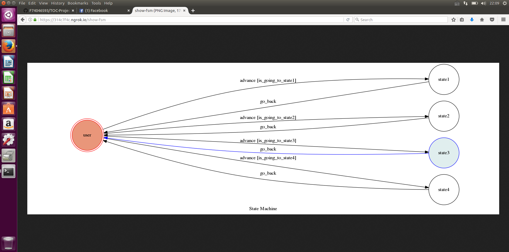

# TOC Project 2017

Template Code for TOC Project 2017

A telegram bot based on a finite state machine

## Finite State Machine

## Usage
* user
	* Input: "u1"
		* Reply: "one pass,one fail"

	* Input: "u2"
		* Reply: "two pass"
		
	* Input: "u3"
		* Reply: "I hope I can pass"
	
	* Input: "mumi"
		* Reply: "mumi.jpg(photo)"

## Author
[F74046593](https://github.com/F74046593)
