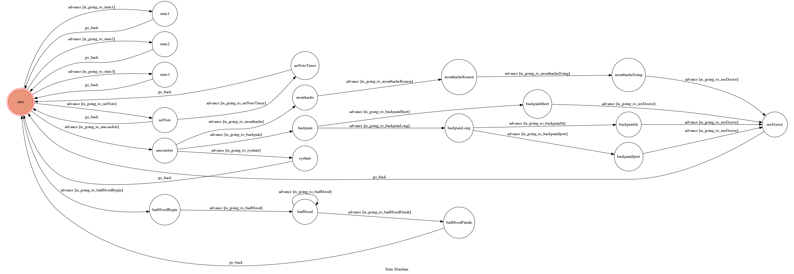

# TOC Project 2017

Template Code for TOC Project 2017

A telegram bot based on a finite state machine

## Finite State Machine

## Usage
The initial state is set to `user`.

Every time `user` state is triggered to `advance` to another state, it will `go_back` to `user` state after the bot replies corresponding message.

* user
	* Input: "go to state1"
		* Reply: "I'm entering state1"

	* Input: "go to state2"
		* Reply: "I'm entering state2"

## Author
[F74046593](https://github.com/F74046593)
